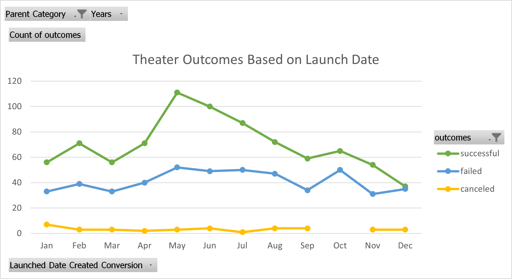
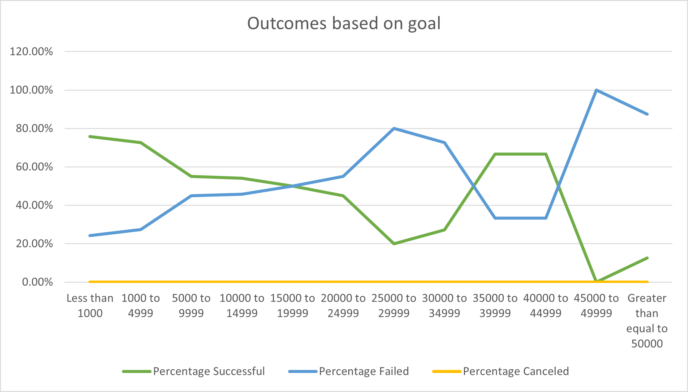

# Kickstarter-analysis
 Weekly assignment1 - Analysis of the Kickstarter Data to uncover trends

## Overview of Project

### Purpose and Background

  The kickstarter project is about helping Louise with one of her project campaigns.She is interested to launch one of her campaigns for Fever Plays under theater category.
  In this project we have collected data under various categories like name of the campaigns, the goal amount, the actual pledged amount, count of backers, categories under
  which campaigns are launched, date of launch and so on. We have analysed the data to draw fuitful insights that can help Louise to launch her campaign in a way so that 
  she can get a good amount of the pledged money and her campaign can be successful. We have taken into consideration all the important data that is relevant to her campaign
  and formatted the data that will provide a clear understanding of the past campaigns, their success and failure and hoe Louise should plan her campaign so that she gets the 
  out of it.
   

## Analysis and Challenges

### Analysis of Outcomes Based on Launch Date

1. In the data that we have collected, the launched date is an Unix timestamp that we have converted to standard timestamp to understand the launch date of the campaign.
2. We particulary analysed the outcomes of the campaigns under theater category for each month.
3. We created a pivot table using this filtered data under theater category for all the years and arranged the data into its rows and columns.
4. This table gave us a clear picture of the total number of successful, failed and canceled campaigns for each month.
5. Using the table we also created a line graph that helped us to determine the trend of the campaign outcomes based on their launch date.
6. We specifically chose to represent our findings using line graph as each of the outcomes whether successful, failed or canceled is clearly demarcated using a line graph
   where the Yaxis represents the count of outcomes and the Xaxis represents each month in a year.
7. If we see each point on the chart we can say that most number of successful kickstarter campaigns were launched in may  followed by june.
8. Towards the starting of the year and in the end of the year the number of successful campaigns is roughly the same.
9. During january,may ,june and october all had roughly equal number of failed campaigns.
10.Under theater category the total number of canceled campaigns were quite less for all the months.

  The line graph depicting our analysis and findings for the campaign outcomes based on launch date is as below:
  
  

### Analysis of Outcomes Based on Goals

1. For the date we collected, the campaings were suceessful or failed depending on the goal amount and pledged amount.
2. We had to analyse the goal amount for each campaign which is a major factor in deciding the success.
3. We categaorized the goal amount into some ranges and then using excel calculated the total number of successful, failed and canceled projects.
4. Also we calculated the total percentage of successful, failed and canceled projects depending on which we created a line graph.
5. Analysing this line that is mentioned below we can see as the goal amount increases the chances of a failed campaign also increases.
6. The number of successful campaigns is maximum when the goal amount is less than 1000$ and as the goal amount is increasing, we can see from the green coloured line graph
   that depicts the successful campaigns below,the percentage of successful campaigns is decreasing.
7. Under the theater category for plays the number of canceled campaigns is zero.
8. Louise should make sure to keep her goal amount in a range of 1000$ to 10000$ so that there will be high chances of a successful campaign for her play.
9. There are also a fair chances of a successful campaign for a goal amount of 35000$ to 45000$ as we can see from the graph.
10. Overall we can say that a moderate goal amount can definitely lead to a successful campaign keeping in mind the other factors too.

  The line graph depicting our analysis and findings for the outcomes based on goal amount is as below:
   
   

### Challenges and Difficulties Encountered

1. The data that we collected was huge and included various categories, regions, camapigns all of which were not required for our analysis.
   To overcome this we filtered our data only for the region and categories we needed. Also we formatted the data so it can be easily read and used for further analysis.
2. We did not have a mean value for all the data that we collected, so we calculated the mean value and replaced some of the calculation with 'NA' where we got errors due to  
   calculation of the fields.
3. The timestamp provided was a Unix timestamp which cannot be easily calculated and read.
   So we converted it into a standard timestamp that can be used to calculate the exact launch date and deadline of a campaign.   

## Results

- What are two conclusions you can draw about the Outcomes based on Launch Date?  

1. Maximum number of successful campaigns under the theater category are launched in the month of May and June. So the chances of a campaign being successful is somewhat
   higher in these months as comapred to other months.
2. The number of failed campaigns is roghly the same over all the months.

- What can you conclude about the Outcomes based on Goals?

  We can clearly conclude that as the goal amount increases the chances of a campaign being successful decreases. The goal amount should be kept moderate or less 
  to attract more backers as it plays a very significant role in deciding the outcome of the camapign.
  

- What are some limitations of this dataset?

  Some more information could have been added in the dataset like the mode of donation to a particular camapign, rewards that backers can get if applicable, messaging system
  of the campaign etc which can contribute to the success or failure of a campaign or even afftect the number of backers in a loop.
  

- What are some other possible tables and/or graphs that we could create?
  We could have created boxplots to show the average goal and pledged amount and it can also help to detect the outliers.
  
